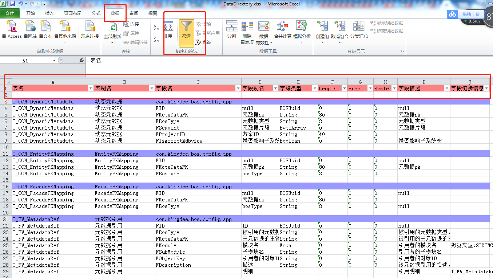
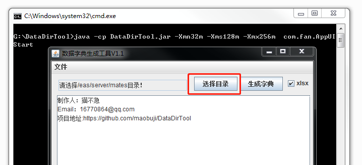

# DataDirTool-金蝶EAS数据字典生成工具

## 说明

本工具可根据EAS服务器中的元数据文件，获得数据表的元数据信息，并导出到Excel中生成数据字典。 

* [DataDirToolV1.1下载](https://github.com/maobuji/DataDirTool/releases/download/1.0/DataDirTool1.0.zip)

样例：可使用Excel的数据筛选功能，查看自己关注的数据表 

## 使用说明

此工具为java开发，需要先安装java运行环境JDK。

工具可能存在bug，为避免风险，请不要直接在服务器上运行此工具，请拷贝对应的服务器文件到本地。

##### 工具使用方法

1. 解压DataDirTool.zip工具包

   

2. 拷贝服务器eas/server/metas元数据文件夹到本地

   

3. 执行run.bat运行工具

   

4. 选择元数据文件夹

   

5. 点击生成字典

6. 生成完毕后，在同级目录下查看生成的字典文件

## 开发配置

